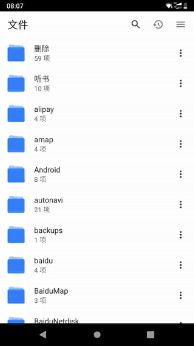

# Browser 文件管理器



* [x] 本地视频服务器
* [x] 有道字典
* [x] 谷歌翻译
* [x] 下载 Twitter 视频
* [x] 下载 YouTube 视频
* [ ] 本地文件服务器
* [ ] 文件管理器
* [ ] 音乐播放器
* [ ] 视频播放器
* [ ] 文件下载工具

## 引用

- https://github.com/DaveGamble/cJSON
- https://github.com/cesanta/mongoose
- https://github.com/tronkko/dirent
- https://github.com/EZLippi/Tinyhttpd
- https://github.com/SheetJS/js-crc32


## 参考

- https://www.man7.org/linux/man-pages/man3/getaddrinfo.3.html

## 错误

## `IPELINE_ERROR_DECODE: Failed to send audio packet for decoding`

注释掉 `mongoose.c`中的：

```c
#if _FILE_OFFSET_BITS == 64 || _POSIX_C_SOURCE >= 200112L || \
    _XOPEN_SOURCE >= 600
                fseeko(pd->file.fp, r1, SEEK_SET);
```

